<div align="center">
  
  <h1>Streamer Assist</h1>
  <p>방송의 순간과 시청자 참여를 한곳에서 관리하는 Windows 앱.</p>
  <p>
    <a href="https://github.com/yechankun/streamer-assist/actions/workflows/ci.yml"></a>
    
    
    <a href="LICENSE"></a>
  </p>
  <p><a href="README.md">English</a> · <strong>한국어</strong></p>
  <p>
    <a href="#주요-기능">주요 기능</a> ·
    <a href="#제품-화면">제품 화면</a> ·
    <a href="#시작하기">시작하기</a> ·
    <a href="#문서">문서</a> ·
    <a href="CONTRIBUTING.md#한국어">기여하기</a>
  </p>
  <picture>
    <source media="(prefers-color-scheme: light)" srcset="docs/assets/screenshots/home-light.png">
    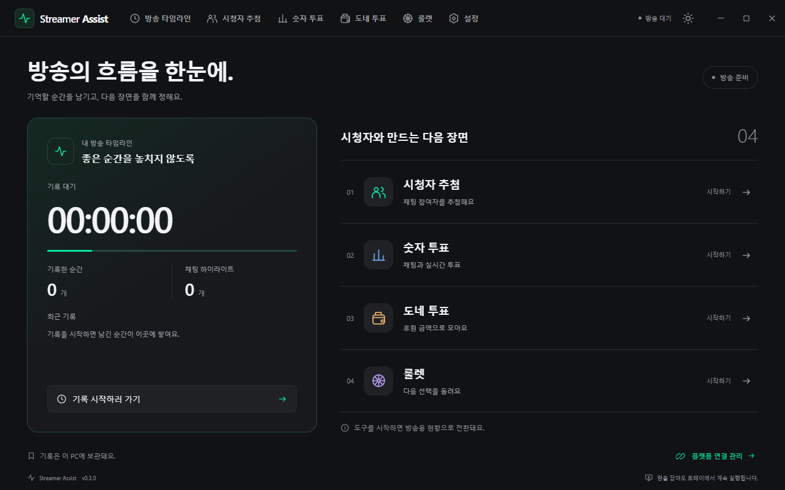
  </picture>
  <p><sub>개발 빌드의 실제 창을 별도 프로필과 생성 데이터로 캡처했습니다. 현재 앱 화면 언어는 한국어입니다.</sub></p>
</div>

## Streamer Assist는?

**치지직·YouTube·트위치** 방송의 순간, 채팅·후원 기록과 시청자 참여 도구를 한곳에 모은 Windows 앱입니다. 프레임 없는 창과 트레이에서 실행하며 플랫폼 연결과 암호화 기록을 사용자 PC에서 처리합니다. 별도 앱 서버를 운영할 필요가 없습니다.

## 주요 기능

| 영역 | 할 수 있는 일 |
| --- | --- |
| **자동 방송 타임라인** | 하나라도 방송이 시작되면 기록하고 모두 종료가 확인되면 저장합니다. 키 인식 전역 단축키로 마커를 남깁니다. |
| **채팅·후원 기록** | 전체 날짜를 기본으로 모든 플랫폼 또는 특정 플랫폼을 조회하고, 시청자·본문·원문 시각으로 찾습니다. |
| **날짜·용량 관리** | 일·주·월 단위로 여러 날짜를 선택하고 암호화 파일 용량을 확인해 삭제합니다. 진행 중 기록은 보호합니다. |
| **로컬 분석** | 실제 동접 샘플·분 단위 활동·반응·키워드·참여자 통계를 보고 JSONL을 내보냅니다. |
| **선택적 AI 분석** | 연결한 CLI/API 모델을 그룹·기능별로 지정하고 기록 범위를 확인한 뒤 실행하며 사용량·추정 비용을 봅니다. |
| **시청자 추첨** | 채팅·키워드 모집, 구독자·멤버십 필터, 이전 당첨자 제외와 안전한 난수 추첨을 제공합니다. |
| **숫자·도네 투표** | 채팅 명령 또는 YouTube 기본 투표를 함께 사용하고 지원 후원을 금액·통화 규칙으로 집계합니다. |
| **가중치 룰렛** | 2~12개 항목을 만들거나 종료 결과를 가져옵니다. 칸의 넓이는 실제 추첨 확률과 같습니다. |
| **통합 설정** | 단축키·플랫폼 연결·트레이·시작 앱·테마·로컬 데이터를 관리합니다. |

**AI 연결**은 Codex·Claude·Grok·Antigravity·DeepSeek·Kimi의 CLI/API를 지원합니다. **설정 → AI 연결 → +**에서 AI를 선택하면 독립 버전으로 배포하는 [연결 모듈](https://github.com/yechankun/streamer-assist-ai-connectors)을 내려받습니다. 로그인·모델 조회 후 **기능별 AI**에서 3개 그룹·6개 기능의 모델과 추론 수준을 지정합니다. Codex·Claude·Grok·Kimi는 앱 전용 로그인 프로필을 사용하며 Antigravity는 **PC 로그인 공유**를 직접 켜야 합니다. 분석은 직접 실행할 때만 호출하고 사용량·제공되는 CLI 한도·API 추정 비용을 표시합니다. 공급자 구현과 CLI 실행 파일은 설치 프로그램에 포함하지 않습니다. [AI 연결·기능별 설정 안내](docs/ai-integrations.ko.md)를 참고하세요. 영상·음성 녹화는 제공하지 않습니다.

## 제품 화면

이미지를 누르면 원본으로 볼 수 있습니다. 식별 정보·채팅·후원·동접·결과는 모두 생성한 샘플이며 개인 계정이나 실제 결제를 사용하지 않습니다.

<table>
  <tr>
    <td width="50%"><a href="docs/assets/screenshots/timeline.png">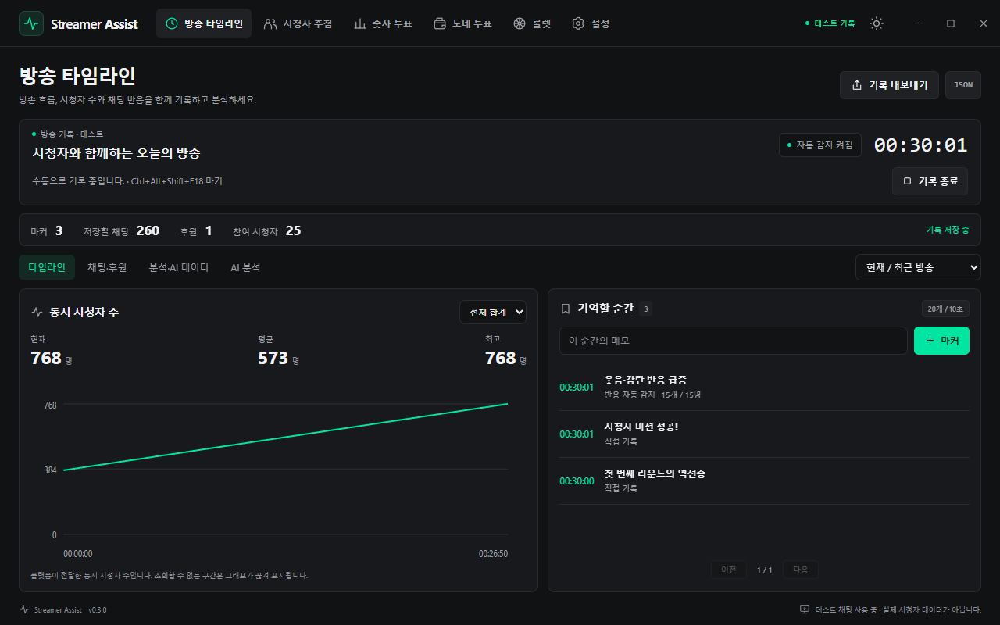</a><br><strong>방송 전체를 한 시간축으로</strong><br>동접 샘플·방송 시계·하이라이트 마커를 함께 확인합니다.</td>
    <td width="50%"><a href="docs/assets/screenshots/chat-storage.png">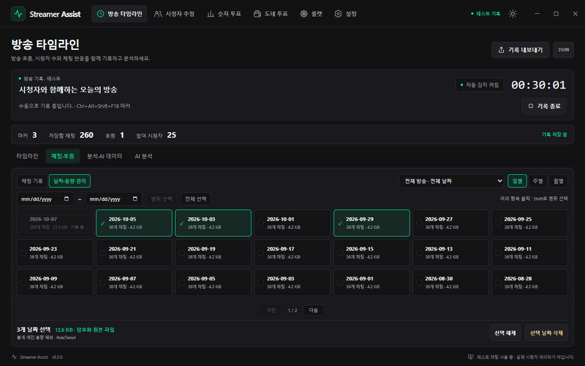</a><br><strong>보관 날짜와 용량을 직접 관리</strong><br>일·주·월 선택, 실제 파일 용량과 진행 중 기록 보호.</td>
  </tr>
  <tr>
    <td width="50%"><a href="docs/assets/screenshots/chat-history.png">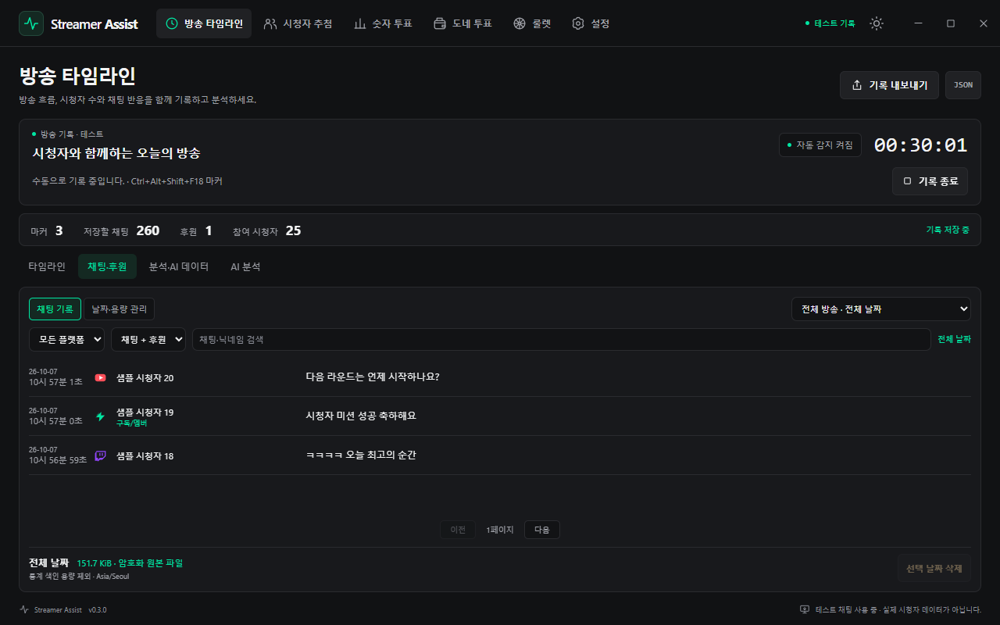</a><br><strong>전체 날짜·플랫폼별 채팅 조회</strong><br>원문 시각, 시청자 검색과 플랫폼 필터.</td>
    <td width="50%"><a href="docs/assets/screenshots/chat-analysis.png">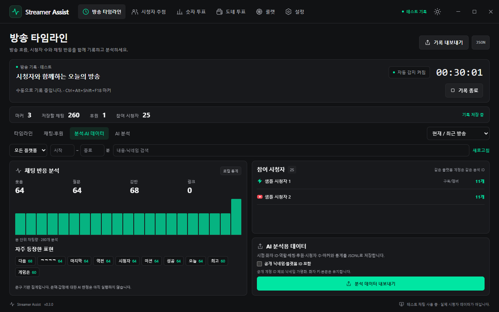</a><br><strong>다음 분석을 위한 데이터 준비</strong><br>로컬 반응·키워드·참여자 통계와 JSONL 내보내기.</td>
  </tr>
  <tr>
    <td width="50%"><a href="docs/assets/screenshots/viewer-raffle.png">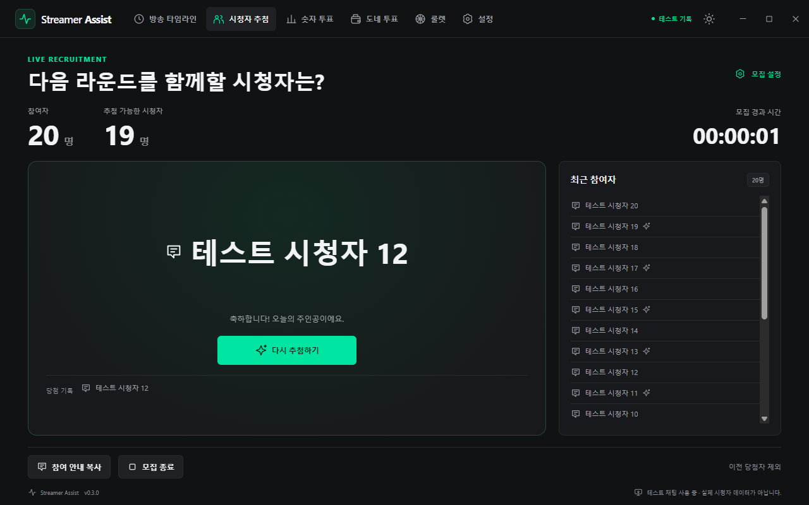</a><br><strong>함께할 시청자를 추첨</strong><br>모집 조건·구독자 필터와 당첨 기록.</td>
    <td width="50%"><a href="docs/assets/screenshots/live-poll.png">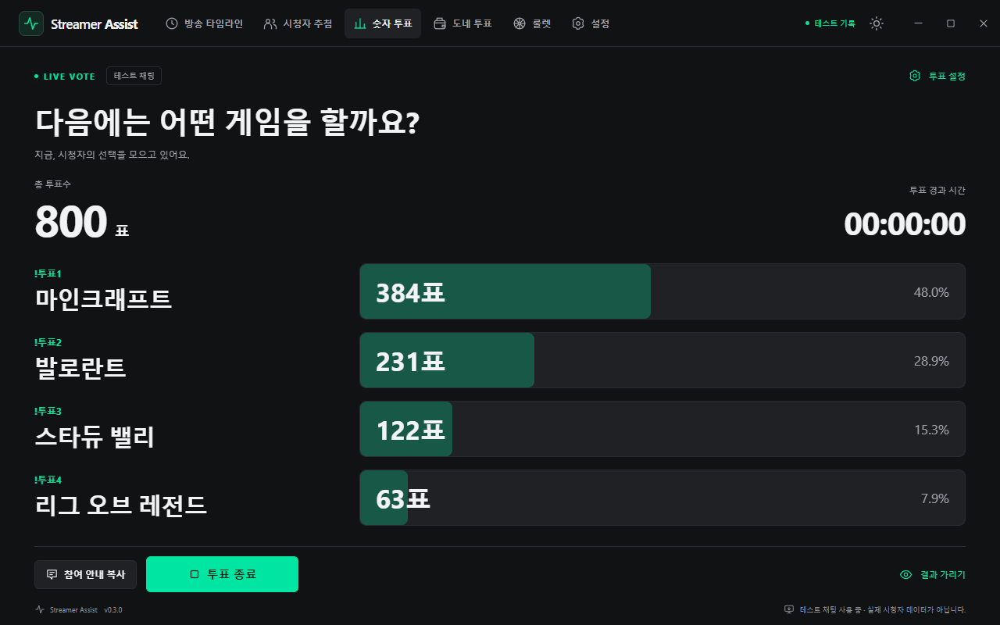</a><br><strong>시청자의 선택을 모으기</strong><br>애니메이션 합계·비율과 방송용 결과 화면.</td>
  </tr>
  <tr>
    <td width="50%"><a href="docs/assets/screenshots/donation-vote.png">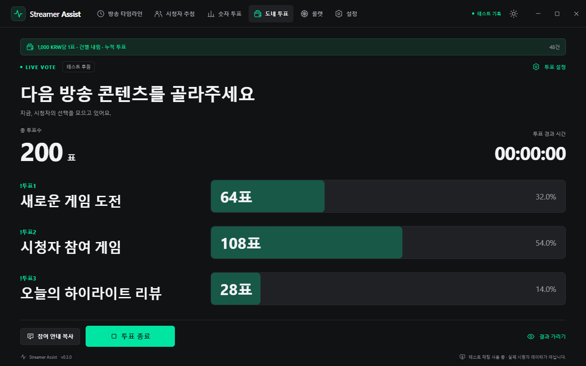</a><br><strong>지원 후원 메시지로 투표</strong><br>최소 금액·금액 배수 규칙으로 집계합니다.</td>
    <td width="50%"><a href="docs/assets/screenshots/roulette.png">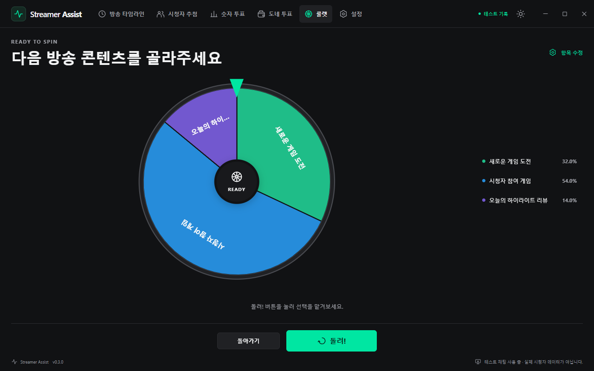</a><br><strong>결과를 가중치 룰렛으로</strong><br>칸의 넓이와 실제 추첨 확률이 일치합니다.</td>
  </tr>
</table>


<details>
<summary>플랫폼 연결·설정·데이터 관리</summary>

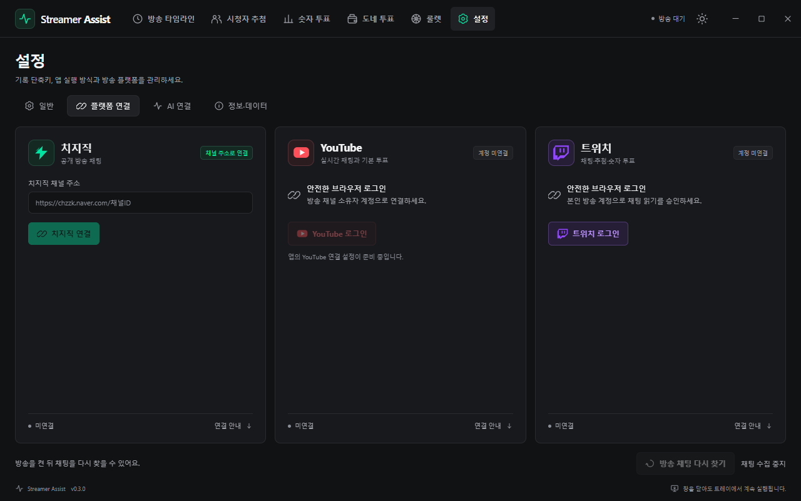

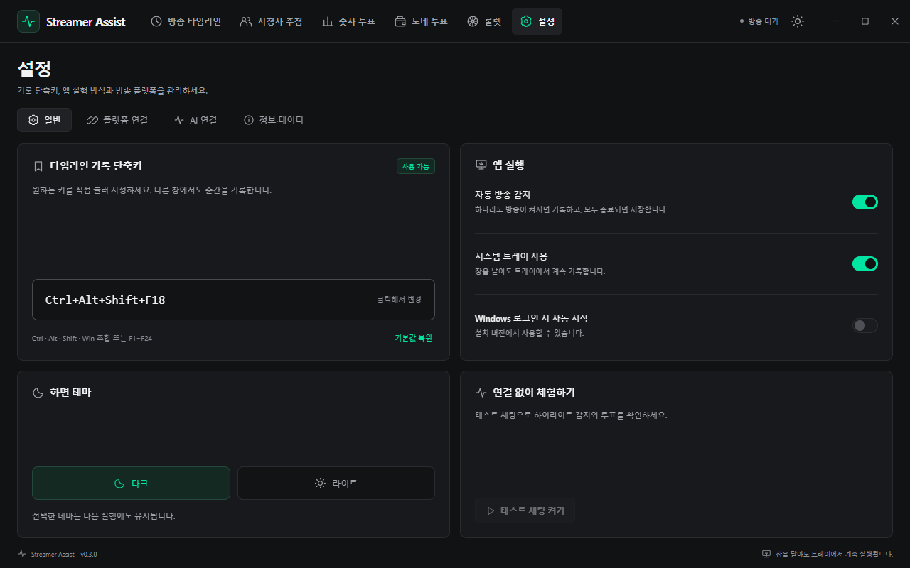


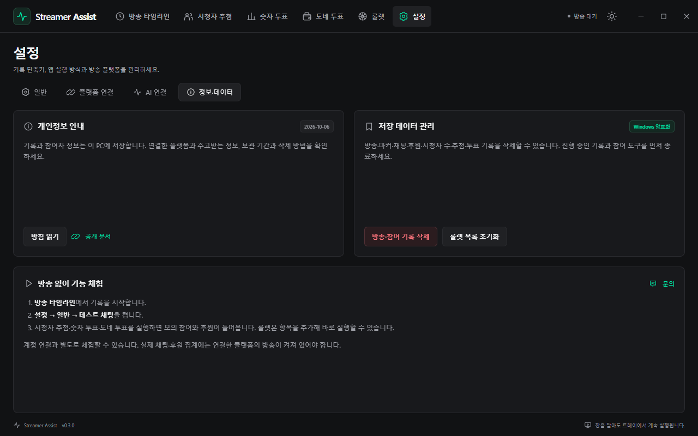

</details>

## 시작하기

**개발 중인 프리뷰입니다.** 설치 파일과 변경 내용은 [최신 GitHub 릴리즈](https://github.com/yechankun/streamer-assist/releases/latest)에서 확인하세요. Store 게시 여부는 [실제 상태 확인](https://github.com/yechankun/streamer-assist/actions/workflows/store-status.yml)과 Microsoft 심사 결과를 따릅니다.

**Windows 10/11 x64**, **Node.js 22 이상**에서 설치 없이 개발합니다.

```powershell
git clone https://github.com/yechankun/streamer-assist.git
cd streamer-assist
npm ci
npm run dev
```

React·CSS는 저장 즉시 갱신하고 Electron 코드는 기록 저장 후 재시작합니다. 계정 없이 **방송 타임라인**에서 기록을 시작한 뒤 **설정 → 일반 → 테스트 채팅**을 켜 도구를 체험합니다. 룰렛은 독립 실행도 가능합니다.

실제 연결은 **설정 → 플랫폼 연결**에서 관리합니다. 치지직 공개 채팅은 채널 주소, YouTube·트위치는 브라우저 승인으로 연결합니다. OAuth는 개발자가 한 번 준비하며 사용자가 토큰을 붙여 넣지 않습니다. [개발자 연결 설정](docs/development.ko.md)을 참고하세요.

성공한 [CI 실행](https://github.com/yechankun/streamer-assist/actions/workflows/ci.yml)의 `windows-packages`에 서명 없는 EXE·개발용 MSIX가 있습니다. 프리뷰·검증용이며 Store 업로드 MSIX는 일반 PC 직접 설치용으로 서명한 파일이 아닙니다.

## 문서

| 안내 | English | 한국어 |
| --- | --- | --- |
| 도구·연결·날짜 관리 | [User guide](docs/user-guide.md) | [사용 가이드](docs/user-guide.ko.md) |
| 기록 형식·분석 데이터 | [Timeline data](docs/timeline-data.md) | [기록·분석 형식](docs/timeline-data.ko.md) |
| AI 로그인·기능별 지정·사용량 | [AI connections](docs/ai-integrations.md) | [AI 연결](docs/ai-integrations.ko.md) |
| 개발 모드·OAuth·테스트·빌드 | [Development](docs/development.md) | [개발 가이드](docs/development.ko.md) |
| 성능 실측·재현 방법 | [Performance](docs/performance.md) | [성능 측정](docs/performance.ko.md) |
| MSIX·Store CI/CD | [Store setup](docs/store-setup.en.md) | [Store 설정](docs/store-setup.md) |
| 심사 시 체험 순서 | [Certification guide](docs/certification.en.md) | [심사용 안내](docs/certification.md) |
| 데이터 처리 | [Privacy policy](docs/privacy.en.html) | [개인정보처리방침](docs/privacy.html) |
| 캡처·기여 | [Screenshots](docs/assets/screenshots/README.md#english) · [Contribute](CONTRIBUTING.md#english) | [캡처](docs/assets/screenshots/README.md#한국어) · [기여](CONTRIBUTING.md#한국어) |

## 개발과 릴리즈

```powershell
npm test                 # 핵심 로직·빌드 캐시 안전성 검사
npm run test:desktop     # 검증된 빌드 + Electron 전체 11종
npm run dist:all         # Windows EXE·MSIX
npm run verify:msix      # Manifest·필수 파일·개인 파일 제외 검사
```

변경한 UI만 확인할 때는 `node scripts/test-desktop.cjs --build --suite timeline`을 사용합니다. AI 로그인·기능별 설정·연결 모듈·디자인 검사는 `--suite ai,ai-component,design`, 테스트 창을 숨기려면 `--hidden`을 추가합니다. 화면 번들 강제 재생성은 `node scripts/build.cjs --force`, 문서 링크 검증은 `npm run docs:check`입니다.

검증된 결과 재사용·증분 타입 검사·번들/패키징 병렬 실행·공개 도구 캐시로 반복 작업을 줄입니다. 소스·결과가 바뀌면 캐시를 무효화하고 타입 오류가 있으면 게시를 차단합니다. 성공 화면 PNG는 선택 실행입니다. [성능 측정](docs/performance.ko.md)에서 작업량과 실측 조건을 확인할 수 있습니다.

Push·PR은 Windows 검사·패키지 검증과 일회용 실행기의 MSIX 설치 검사를 수행합니다. 버전과 일치하는 `v*` 태그는 설치 파일·체크섬을 게시합니다. 최초 Store 게시 후 `STORE_PUBLISH_ENABLED=true`일 때 제출을 자동화합니다. 앱 내부 자동 업데이트는 아직 제공하지 않습니다.

## 데이터와 플랫폼 참고

원문 채팅·후원·공개 참여자 정보·동접·방송 메타데이터를 Windows DPAPI로 이 PC에 암호화 보관하며 사용자가 삭제할 때까지 유지합니다. 날짜별 삭제는 다른 날짜와 마커를 보존합니다. 전체 삭제는 분석용 식별 값을 초기화하고 내보낸 파일·별도 백업은 직접 관리합니다. Markdown·JSON·JSONL은 암호화되지 않은 파일이며 원문에 개인정보가 포함될 수 있습니다.

치지직은 비공식 공개 채팅 읽기, YouTube·트위치는 공식 API와 브라우저 승인을 사용합니다. 트위치 Bits를 BITS 단위 기록으로 보관하지만 Bits 도네 투표·트위치 기본 투표는 지원하지 않습니다. 실제 로그인·채팅·기본 투표·유료 후원 수신은 실환경 검증이 필요합니다. [플랫폼 제한](docs/user-guide.ko.md#플랫폼과-제한)을 참고하세요.

## 기여와 라이선스

[Issues](https://github.com/yechankun/streamer-assist/issues)와 범위가 명확한 PR을 환영합니다. [기여 안내](CONTRIBUTING.md#한국어)에 따라 영어·한국어를 함께 갱신하고 캡처에서 개인정보를 제외하세요.

[MIT 라이선스](LICENSE)로 배포합니다. NAVER·치지직·YouTube·트위치와 제휴하지 않은 독립 프로젝트입니다. 참여 규칙은 [CHZZK VOTE](https://github.com/WisdomIT/chzzk-vote), 공개 채팅 프로토콜은 [kimcore/chzzk](https://github.com/kimcore/chzzk)를 참고했습니다. 제품 화면·배치·브랜딩은 Streamer Assist 자체 구현입니다.
