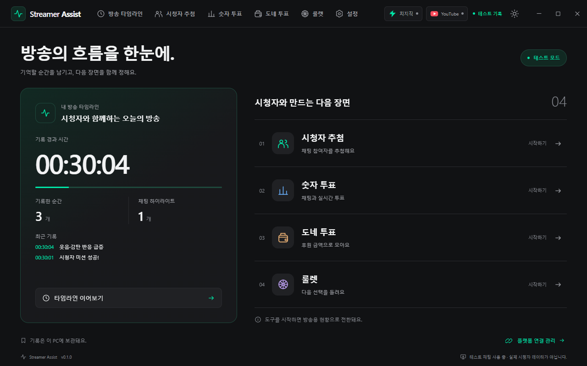

<div align="center">
  
  <h1>Streamer Assist</h1>
  <p>방송의 순간과 시청자 참여를 한곳에서 관리하는 Windows 앱.</p>
  <p>
    <a href="https://github.com/yechankun/streamer-assist/actions/workflows/ci.yml"></a>
    
    
    <a href="LICENSE"></a>
  </p>
  <p><a href="README.md">English</a> · <strong>한국어</strong></p>
  <p>
    <a href="#주요-기능">주요 기능</a> ·
    <a href="#제품-화면">제품 화면</a> ·
    <a href="#시작하기">시작하기</a> ·
    <a href="#문서">문서</a> ·
    <a href="CONTRIBUTING.md#한국어">기여하기</a>
  </p>
  <picture>
    <source media="(prefers-color-scheme: light)" srcset="docs/assets/screenshots/home-light.png">
    
  </picture>
  <p><sub>main의 실제 앱을 별도 프로필과 샘플 데이터로 캡처했습니다. 현재 앱 화면 언어는 한국어입니다.</sub></p>
</div>

## Streamer Assist는?

편집할 순간을 기록하고, 다음 콘텐츠를 시청자와 함께 결정하세요. Streamer Assist는 **치지직과 YouTube** 방송을 위한 타임라인·채팅 반응 하이라이트·시청자 참여 도구를 하나로 모았습니다. 운영할 별도 백엔드 서버 없이 사용자 PC에서 플랫폼에 직접 연결합니다.

홈에서 기록 상태·최근 마커·실행 중인 도구를 함께 확인합니다. 윈도우 기본 제목 표시줄을 없앤 화면, 다크·라이트 테마, 애니메이션이 있는 방송용 현황과 선택 가능한 시스템 트레이 실행을 제공합니다.

## 주요 기능

| 도구              | 할 수 있는 일                                                                                                          |
| ----------------- | ---------------------------------------------------------------------------------------------------------------------- |
| **방송 타임라인** | 원하는 전역 단축키로 다른 창에서도 순간을 기록합니다. 메모·채팅 반응 급증을 모아 방송 후 Markdown/JSON으로 내보냅니다. |
| **시청자 추첨**   | 채팅 또는 키워드로 모집하고 구독자·멤버십 필터, 이전 당첨자 제외, 당첨자 공개 애니메이션을 사용합니다.                 |
| **숫자 투표**     | 치지직·YouTube의 표를 합산합니다. 채팅 명령 또는 YouTube 기본 실시간 투표를 선택하고 큰 글자와 그래프로 보여줍니다.    |
| **도네 투표**     | 치지직 치즈와 YouTube 슈퍼챗에서 조건에 맞는 후원을 받아 1인 1표 또는 금액 배수로 집계합니다.                          |
| **가중치 룰렛**   | 2~12개 항목을 직접 만들거나 종료된 투표를 가져옵니다. 칸의 넓이가 실제 추첨 확률과 같은 룰렛을 돌립니다.               |
| **통합 설정**     | 키 인식으로 단축키를 지정하고 플랫폼 연결·트레이·테마·로컬 기록을 관리합니다.                                          |

자동 하이라이트는 로컬 채팅 통계로 편집 후보를 찾습니다. 영상·음성을 분석하거나 외부 AI 서비스를 호출하지 않습니다.

## 제품 화면

이미지를 누르면 원본 크기로 볼 수 있습니다. 참여자·후원·득표수는 생성한 샘플이며 실제 계정이나 결제 내역은 포함하지 않습니다.

<table>
  <tr>
    <td width="50%">
      <a href="docs/assets/screenshots/timeline.png"></a>
      <br><strong>다시 보고 싶은 순간을 기록하세요</strong><br>
      시간별 메모와 채팅 반응 근거를 한 타임라인에서 확인합니다.
    </td>
    <td width="50%">
      <a href="docs/assets/screenshots/live-poll.png"></a>
      <br><strong>다음 콘텐츠를 함께 결정하세요</strong><br>
      투표를 시작하면 방송용 현황으로 바로 전환됩니다.
    </td>
  </tr>
  <tr>
    <td width="50%">
      <a href="docs/assets/screenshots/viewer-raffle.png"></a>
      <br><strong>시청자를 오늘의 주인공으로</strong><br>
      참여자 모집부터 조건 설정과 당첨 기록까지 관리합니다.
    </td>
    <td width="50%">
      <a href="docs/assets/screenshots/donation-vote.png"></a>
      <br><strong>후원으로 시청자의 선택을 모으세요</strong><br>
      금액 규칙·합계·통화 처리 기준을 함께 표시합니다.
    </td>
  </tr>
  <tr>
    <td width="50%">
      <a href="docs/assets/screenshots/roulette.png"></a>
      <br><strong>마지막 선택은 룰렛으로</strong><br>
      모인 표를 가중치로 바꿔 룰렛을 돌립니다.
    </td>
    <td width="50%">
      <a href="docs/assets/screenshots/settings.png"></a>
      <br><strong>방송 환경에 맞게 설정하세요</strong><br>
      단축키·트레이 실행·테마를 한곳에서 관리합니다.
    </td>
  </tr>
</table>

<details>
  <summary>방송 중 워크스페이스</summary>
  <p>홈에서 기록 경과 시간, 최근 마커와 도구 실행 상태를 확인합니다.</p>
  
</details>

<details>
  <summary>개인정보 안내와 로컬 데이터 관리</summary>
  <p>설정 → 정보·데이터에서 내장 개인정보처리방침을 읽고, 확인 후 방송·참여 기록을 삭제하거나 룰렛 목록을 초기화할 수 있습니다.</p>
  
</details>

## 시작하기

**현재 개발 중인 프리뷰입니다.** 위 화면과 기능은 `main` 기준입니다. 공개된 `v0.1.0` 설치 파일은 이전 MVP로, 현재 디자인과 모든 도구가 포함되어 있지 않습니다. Microsoft Store 공개도 준비 중입니다.

| 방법                 | 안내                                                                                                                                                                           |
| -------------------- | ------------------------------------------------------------------------------------------------------------------------------------------------------------------------------ |
| **현재 프리뷰 실행** | 아래 개발 모드로 실행합니다. 앱 설치가 필요하지 않습니다.                                                                                                                      |
| **CI 빌드 다운로드** | 성공한 [CI 실행](https://github.com/yechankun/streamer-assist/actions/workflows/ci.yml)의 `windows-packages`를 내려받습니다. Artifact 다운로드에는 GitHub 로그인이 필요합니다. |
| **배포 버전 확인**   | [GitHub Releases](https://github.com/yechankun/streamer-assist/releases)에서 버전과 릴리즈 설명을 확인하세요.                                                                  |

개발 실행 환경: **Windows 10/11 x64**, **Node.js 22 이상**.

```powershell
git clone https://github.com/yechankun/streamer-assist.git
cd streamer-assist
npm ci
npm run dev
```

Vite와 Electron 창이 함께 열립니다. React·CSS를 저장하면 화면에 즉시 반영되고, Electron 코드를 수정하면 기록을 저장한 뒤 앱을 자동 재시작합니다.

계정을 연결하지 않고 체험하려면:

1. **방송 타임라인**에서 기록을 시작합니다.
2. **설정 → 일반 → 테스트 채팅 켜기**를 누릅니다.
3. 모의 참여·후원으로 추첨과 숫자·도네 투표를 사용합니다. 룰렛은 기록 시작 없이도 사용할 수 있습니다.

실제 플랫폼은 **설정 → 플랫폼 연결**에서 치지직 채널 주소 또는 YouTube 브라우저 로그인으로 연결합니다. 사용자가 토큰을 직접 입력할 필요는 없습니다. 소스를 직접 빌드해 YouTube 로그인을 사용하려면 [개발자 OAuth 설정](docs/development.ko.md#youtube-oauth)을 한 번 준비합니다.

GitHub의 EXE 빌드는 현재 코드 서명되지 않았습니다. MSIX는 Store 제출용이며 직접 설치할 수 있는 신뢰 서명을 포함하지 않습니다.

## 문서

| 내용                                | English                                                  | 한국어                                                |
| ----------------------------------- | -------------------------------------------------------- | ----------------------------------------------------- |
| 도구 사용법·투표 규칙·플랫폼 동작   | [User guide](docs/user-guide.md)                         | [사용 가이드](docs/user-guide.ko.md)                  |
| 변경 즉시 반영·OAuth 설정·코드 구조 | [Development](docs/development.md)                       | [개발 가이드](docs/development.ko.md)                 |
| MSIX 패키징과 Store 자동 업데이트   | [Store setup](docs/store-setup.en.md)                    | [Store 자동 배포](docs/store-setup.md)                |
| 기여 방법                           | [Contributing](CONTRIBUTING.md#english)                  | [기여 안내](CONTRIBUTING.md#한국어)                   |
| 제품 화면 다시 캡처하기             | [Screenshots](docs/assets/screenshots/README.md#english) | [화면 캡처](docs/assets/screenshots/README.md#한국어) |

[개인정보처리방침](https://yechankun.github.io/streamer-assist/privacy.html)과 [Store 심사용 체험 안내](docs/certification.md)는 현재 한국어로 제공합니다.

## 개발과 배포

```powershell
npm test                 # 핵심 로직 검증
npm run test:desktop     # 빌드 및 격리된 Electron 검사
npm run dist             # Windows EXE 설치 파일
npm run dist:msix        # Microsoft Store MSIX 패키지
```

- **Push / PR:** Windows 검증, EXE·MSIX 생성, 패키지 검사와 일회용 GitHub 실행기에서 설치·실행 검사를 수행합니다.
- **버전 태그:** `package.json`과 일치하는 `v*` 태그를 올리면 설치 파일과 SHA256 체크섬을 GitHub Releases에 등록합니다.
- **Store 업데이트:** 최초 게시와 API 인증 준비가 끝난 뒤 자동 제출을 켜면 같은 MSIX를 Microsoft 심사에 제출합니다.
- **개인정보 문서:** 변경 시 GitHub Pages에 자동 배포합니다.

전체 흐름은 [개발 가이드](docs/development.ko.md)에 있습니다. 앱 내부 자동 업데이트는 아직 제공하지 않습니다.

## 데이터와 플랫폼 안내

방송 기록과 YouTube 계정 토큰은 Windows DPAPI로 이 PC에 암호화 저장합니다. 전체 채팅 로그는 파일에 저장하지 않습니다. 사용자가 직접 저장하는 Markdown/JSON 내보내기는 일반 파일입니다.

치지직은 비공식 공개 채팅 읽기 프로토콜을 사용하므로 플랫폼 변경이나 로그인이 필요한 방송에서는 연결이 제한될 수 있습니다. YouTube는 공식 API와 브라우저 OAuth를 사용합니다. 동작과 검증 범위는 [사용 가이드](docs/user-guide.ko.md#플랫폼과-제한)에 있습니다.

## 기여와 라이선스

Issue와 Pull Request를 환영합니다. 개발 환경·검증·영어와 한국어 문서 수정 방법은 [CONTRIBUTING.md](CONTRIBUTING.md#한국어)를 참고하세요.

[MIT License](LICENSE)로 배포합니다. NAVER·치지직 또는 YouTube와 제휴하지 않은 독립 프로젝트입니다.

참여 동작은 공개된 [CHZZK VOTE 소스](https://github.com/WisdomIT/chzzk-vote), 치지직 공개 채팅 프로토콜은 [kimcore/chzzk](https://github.com/kimcore/chzzk)를 참고했습니다. 저장소의 제품 화면·레이아웃·브랜딩은 Streamer Assist 자체에서 제작한 것입니다.
