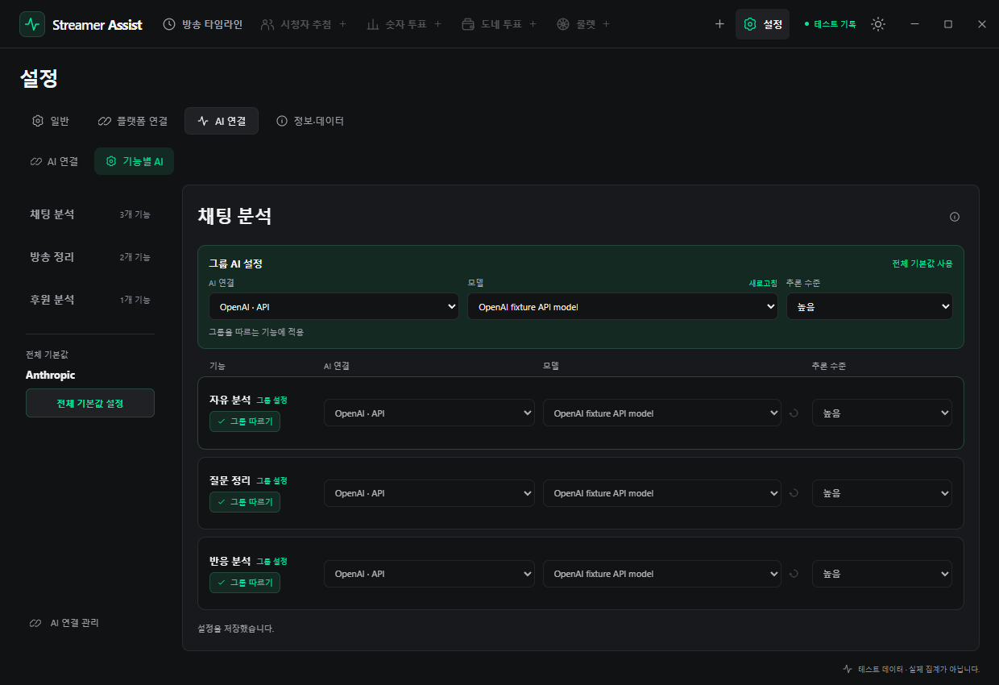
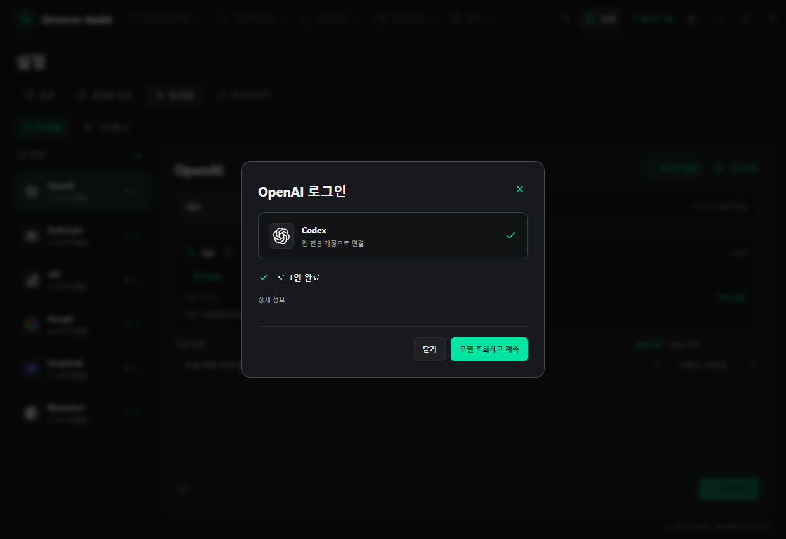
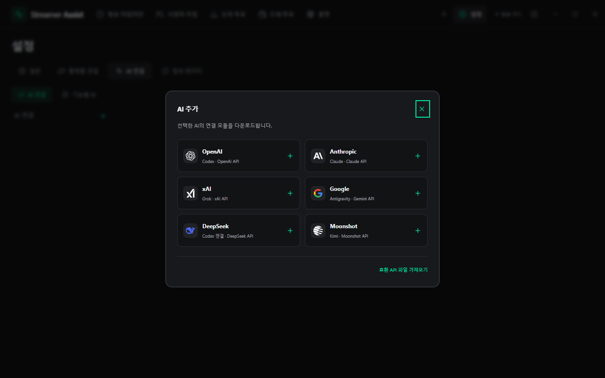

# AI connections and chat analysis

[한국어](ai-integrations.ko.md) · [User guide](user-guide.md) · [Product overview](../README.md)

Use AI to organize questions, reactions and the flow of a broadcast from chat. Recording, audience tools and local statistics also work without an AI connection.

## Run your first analysis

1. Add an AI with **설정 → AI 연결 → +**.
2. For **CLI**, install or detect the tool and sign in. For **API**, connect a key.
3. Query models and select an AI/model in **기능별 AI**. Selections save automatically.
4. In **방송 타임라인 → AI 분석**, select the function and record scope, review the transmission preview and run.

Connections support Codex, Claude, Grok, Antigravity, DeepSeek and Kimi.

## Providers

| Mode | Connection | Access and billing |
| --- | --- | --- |
| **CLI** | Sign into an installed AI tool | Uses that CLI account's plan and limits |
| **API** | Connect a key from the provider console | Separate API access and usage billing |

Codex, Claude, Grok and Kimi use app-specific login profiles. Antigravity requires explicit **PC 로그인 공유** and uses the shared PC session. DeepSeek's CLI bridge also uses an API key.

<details>
<summary>Provider-specific CLI/API and model support</summary>

| Provider | CLI | API |
| --- | --- | --- |
| OpenAI | [Codex](https://developers.openai.com/codex/noninteractive), app-specific CLI sign-in | Responses |
| Anthropic | [Claude Code](https://code.claude.com/docs/en/headless), app-specific CLI sign-in | Messages |
| xAI | [Grok Build](https://docs.x.ai/build/cli/headless-scripting) | Chat Completions |
| Google | [Antigravity CLI](https://antigravity.google/docs/cli/headless/) | Gemini API, a separate service |
| DeepSeek | [Official Codex integration](https://api-docs.deepseek.com/quick_start/agent_integrations/codex/), using a DeepSeek API key | Chat Completions |
| Moonshot | [Kimi Code CLI](https://www.kimi.com/code/docs/en/kimi-code-cli/reference/kimi-command.html) | Kimi/Moonshot Chat Completions |

CLI subscriptions and API credentials have separate entitlements and billing. Models cannot be typed manually. Select only models retrieved from the CLI’s model-list command/control protocol or the API’s model list. Save the model and reasoning level in Settings → AI connections → **기능별 AI**. Connection setup retains its basic model as a starting choice; each function's assignment controls execution. Only supported reasoning choices are shown. Selecting the service default omits an explicit override. An incompatible CLI/model fails with a visible explanation.

</details>

## Function settings

| Analysis you want | Group |
| --- | --- |
| Free-form requests, questions or reactions | Chat analysis |
| Broadcast summary or highlights | Broadcast review |
| Donation summary | Donation analysis |

Set a group's AI/model to use it across the group. Turn **그룹 따르기** off for a function-specific choice; turn it back on to restore inheritance.

Changes save immediately. Settings resolve from **individual function → group → overall default**. Choose **AI 사용 안 함** to disable analysis.

<details>
<summary>Inheritance, disabled functions, unavailable connections and screenshots</summary>

| Group | Functions |
| --- | --- |
| Chat analysis | Free-form analysis, question organization, reaction analysis |
| Broadcast review | Broadcast summary, highlights |
| Donation analysis | Donation summary |

Choose an AI, model and reasoning level directly from the inline dropdowns; changes save automatically without a modal or Apply button. **그룹 따르기** is enabled by default. Turn it off to keep the current value as an individual setting. Group changes affect only functions with this toggle enabled. Turning it back on removes the individual setting and uses the current group value. Only authenticated CLI or saved API connections and their discovered models are selectable. **전체 기본값 설정** edits the overall default inline; **전체 기본값 사용** restores a group's inheritance.

An unavailable or removed connection keeps its assignment and displays the reason. The app does not silently switch to a different AI or billing mode. Analysis requests identify the function; the backend resolves and snapshots its actual AI, mode, model and reasoning level. Editing settings later does not change an analysis already running. Existing usable connection settings migrate to the overall default.

**AI 사용 안 함** is available in the overall, group and individual AI dropdowns. Disabling a group turns AI off for its inheriting functions while preserving independent settings. Disabled functions do not fall back to another AI or send analysis requests.



These 1240 × 850 native captures use synthetic model and account fixtures; no real account or paid request is used.

</details>

## Scope, privacy and results

Before running, review the scope and **included / total records**. If the input limit is exceeded, the app samples across the scope and labels the selection.

Nicknames are pseudonymous and public account IDs excluded by default. **Personal information typed into chat remains in the text.**

Stop a running request if needed. Results are encrypted on your PC and can be reopened or deleted separately from the source chat archive.

<details>
<summary>Transmission content, sampling and retention</summary>

The context builder counts the entire selected range and selects a deterministic sample across that range when the input budget is exceeded. Preview shows **included / total records**, bytes, an approximate token estimate, and sampling status. Actual token counts come from the provider response. A sample is never presented as complete original-text coverage.

Default data replaces public nicknames with pseudonyms and excludes public account IDs. Analytical speaker IDs, platforms, timestamps and original messages remain. Identifiers written into message text are not automatically removed. Public identities are opt-in. Viewer content is untrusted data, and generated output is displayed as plain text.

API keys and results use the Windows encrypted store. Saved keys are never returned to the renderer. Requests can be canceled; saved results can be selected and deleted. Results have bounded retention and are separate from the source archive. Providers and CLIs control their own retention and logs.

</details>

## Usage, limits and cost

Results show usage, available CLI limits and estimated API cost. Information the provider does not return is marked unavailable.

Estimated API cost can differ from the final bill. CLI subscription limits and API billing are separate.

<details>
<summary>Token, cache and pricing calculations</summary>

CLI limits come only from official output or documented read-only protocols. Codex exposes session/weekly windows and reset times. Other CLIs expose limits when their official events provide them; otherwise the UI explains that the information is unavailable. API token usage is never converted into a subscription quota estimate.

Results show actual input, output, cache and reasoning tokens when supplied. Missing counts remain unavailable. API fees are **estimates** calculated from actual usage and verified model rates, unless the provider returns an actual charge. Cached/reasoning tokens already included in other counts are not counted twice. Missing pricing is never shown as zero cost. Taxes, exchange rates, discounts and final invoices may differ.

Rates can be updated from official model metadata or imported JSON pricing. Their source and effective/check date are retained. CLI account plans are shown separately from API billing.

See [timeline data](timeline-data.md) and the [development guide](development.md).

</details>

## Components and updates

Signed-in CLIs show **로그인 완료**. Sign out before switching accounts; change API keys through **API 키 관리**.

Use **설치 관리** for CLI installation/updates and **고급 관리** for connectors. Updates become available after a newer release is confirmed. The app preserves separately installed external CLIs.

<details>
<summary>Login, logout and version-management details</summary>

Use **다운로드·설치** to prepare a CLI in the app profile's `ai/components/` directory. Expand **설치 관리** to detect an existing CLI with **설치 찾기**, check versions, update, roll back or remove an app-managed installation. Connector modules are managed separately through **고급 관리**. External CLI installations are preserved.

A signed-in CLI shows **로그인 완료** with its login button disabled. Sign out before switching accounts. Saved API credentials can be changed through **API 키 관리**. Selecting an AI or opening management automatically checks CLI and connector releases; results are reused for five minutes. Update is enabled only when a newer version is confirmed. Current, checking, failed and unknown external-CLI version states disable the action and show the reason. **버전 확인** performs a fresh check.

CLI installation and updates refresh the provider's download recipe first. Grok's official Windows package contains a Brotli-compressed executable; the app verifies the archive's SHA-512 integrity before decompressing it with a size limit. Native binaries remain outside the app installer.

**Login** starts an actual authentication flow in the account connection dialog. Codex, Claude, Grok and Kimi use separate app profiles for authentication, model discovery, usage and analysis. Existing PC credentials are not copied. Their official logout flow affects the app's private profile before fresh authentication. The first upgrade to private profiles requires a new CLI login; API connections are preserved. The app shows waiting, success, failure and cancellation states, including one-time codes supplied by the CLI.

Provider modules declare vendor-supported profile variables. Codex uses [CODEX_HOME and file credential storage](https://learn.chatgpt.com/docs/auth), Claude separates both Claude and Anthropic profiles, and Grok/Kimi use their official data-root overrides. CLI credentials follow the CLI's own storage format; app-managed API keys use Windows encryption.

Antigravity uses the [OS credential manager](https://www.antigravity.google/docs/cli/install/) and does not document a separate authentication namespace. Google API connections keep credentials within the app. To use Antigravity, explicitly enable **PC 로그인 공유** in its CLI settings; its login/logout then affects the shared PC session. The app automatically checks the official read-only `/usage` response during sign-in without submitting an analysis or consuming tokens. Once authentication is confirmed, waiting ends and **모델 조회하고 계속** retrieves the actual available models. **로그인 완료 확인** also checks authentication while waiting. Opening or closing a terminal alone never means login succeeded; canceled attempts cannot become successful from a late response.

**Logout** clears the app's selected model, connection and quota information. Supported CLIs sign out only the app's private profile. Kimi uses its capability-gated ACP logout response. For explicitly shared Antigravity connections, run `/logout` in the opened CLI, close it and confirm completion. API and DeepSeek connections clear only the app's encrypted key, preserving separate browser sessions. Installation, updates and removal display completion only after the operation finishes, and overlapping operations on the same component are blocked.

The logout button appears for a CLI connection confirmed by login or model discovery, or an API connection with a saved key. It disappears after that connection is signed out in the app, including after an app restart. CLI and API connections keep separate login states.

DeepSeek's CLI bridge and each provider's API use **API 키 연결 / API 연결 창 열기** to open the official console, save an encrypted key, and verify access by retrieving actual available models. This does not submit an analysis request. The app does not collect account passwords or return CLI OAuth tokens to the renderer. Older connectors without authentication recipes display an update instruction.



Native Electron capture from an isolated test profile. The authentication result uses a simulated CLI response; no real account is signed in.

Binaries are excluded from installers and ASAR. Downloads use official release metadata, SHA-256/SHA-512 checksums, and staged publication. Failed or canceled updates preserve the previous active version. API drivers use the shared built-in HTTP engine; provider SDKs are unnecessary. Connections can be disabled, and user-added providers removed.

The provider list’s **+** button imports JSON endpoint and compatibility metadata. Compatible APIs use the protocol implementation of an installed connector module, including HTTPS and localhost endpoints. Executable connector modules come only from the fixed, verified GitHub source described below.

```json
{
  "schemaVersion": 1,
  "id": "custom-local-model",
  "name": "Local model",
  "protocol": "chat",
  "baseUrl": "http://127.0.0.1:1234/v1",
  "models": []
}
```

Model effort metadata can be updated using a type: model-capabilities profile. Metadata alone never adds selectable models; query the connected API for its model list. Changes to CLI flags or output parsing can be handled by a connector module update. Shared host ABI changes require an app update.

</details>

## Querying models

If models are missing, sign in and select **목록 조회**. The login dialog's **모델 조회하고 계속** and API dialog's **저장하고 연결 확인** also retrieve them.

Choose only queried models and supported reasoning levels. **AI 지정하기** in analysis opens the function's settings.

<details>
<summary>Discovery protocols and connection defaults</summary>

Detect/install and sign into the CLI, then select **모델 → 목록 조회**. Codex uses app-server model/list; Claude returns models in its initialization control response; Grok/Antigravity expose model-list commands; Kimi provides ACP session metadata. No model prompt or paid inference is started. A failed query never falls back to an invented default list.

The CLI dialog's **모델 조회하고 계속** and API dialog's **저장하고 연결 확인** also retrieve models. Entering a key and using **목록 조회** on the API connection screen encrypts the key before querying the actual model list. Save a basic model and supported reasoning level with **연결 저장**.

Apply execution settings in **기능별 AI** using each group's or function's AI connection, model and reasoning dropdowns. Use **새로고침** to refresh discovered models. The analysis screen selects a function, request and scope, and displays its resolved connection, model and reasoning. **기능별 AI 설정** or **AI 지정하기** navigates to the relevant group list and highlights the selected function.

</details>

## GitHub provider components

Adding an AI downloads its required connector. Removing it with **×** retains keys and the connector for re-adding. To delete connector files, use **고급 관리 → 연결 모듈 제거**.

Connector updates handle provider compatibility changes. If installation/download fails, review its displayed reason and retry.

<details>
<summary>Distribution repository, verification and offline reuse</summary>



Provider implementations are distributed separately in [streamer-assist-ai-connectors](https://github.com/yechankun/streamer-assist-ai-connectors). Each LLM has its own version and release tag, such as openai-v0.1.0 or anthropic-v0.1.0. The main installer contains the common host, encrypted settings/results, and download manager; provider adapter source and native CLI binaries are excluded.

Use **+** to add a provider and **×** beside its list entry to remove the connection and its settings panel. Its encrypted key and adapter remain available for re-adding. To free adapter files, use **고급 관리 → 연결 모듈 제거**. That view also checks versions, updates, and restores the retained previous version. Existing CLI programs remain independently managed. Original CLI payloads come from vendor distribution sources; this repository distributes our own integration code.

Failed downloads show the operation phase and a public HTTP status or safe filesystem error code. Retry with **다운로드·추가** without removing the connection.

The app accepts artifacts only from the configured GitHub repository. Publishing CI compares GitHub API asset SHA-256 values with downloaded bytes, then publishes its verification records at the same repository’s `distribution-v1/index.json`. The client trusts that publisher at a fixed GitHub HTTPS path and checks repository, tag, asset URL, exact catalog bytes, package/file hashes and ABI. This is publisher-authority verification, not a separate signature or a fresh client API response. Public metadata delivery avoids the user’s anonymous REST quota and requires no personal GitHub token.

Transient Windows file locks receive bounded retries; active files are never deleted before their replacement succeeds. The dev server ignores profile and download staging directories. Installed modules and device-protected verification metadata support offline reuse. Legacy REST lookups honor rate-limit reset times after HTTP 403 instead of repeatedly sending requests.

Provider releases run independent GitHub Actions tests and upload their package, then refresh the shared catalog. This can update one provider’s CLI arguments, output parsing, model discovery, API mapping, pricing, and upstream download recipe without rebuilding the desktop app. Changes to the shared host ABI require an app update.

</details>

[Data formats](timeline-data.md) · [Development](development.md)
