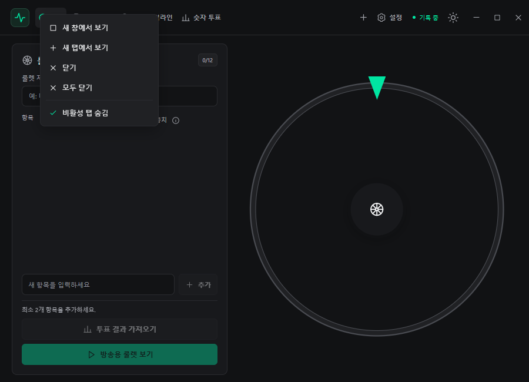
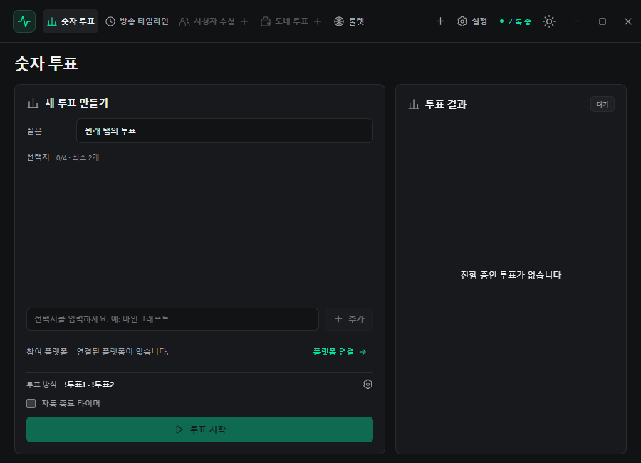
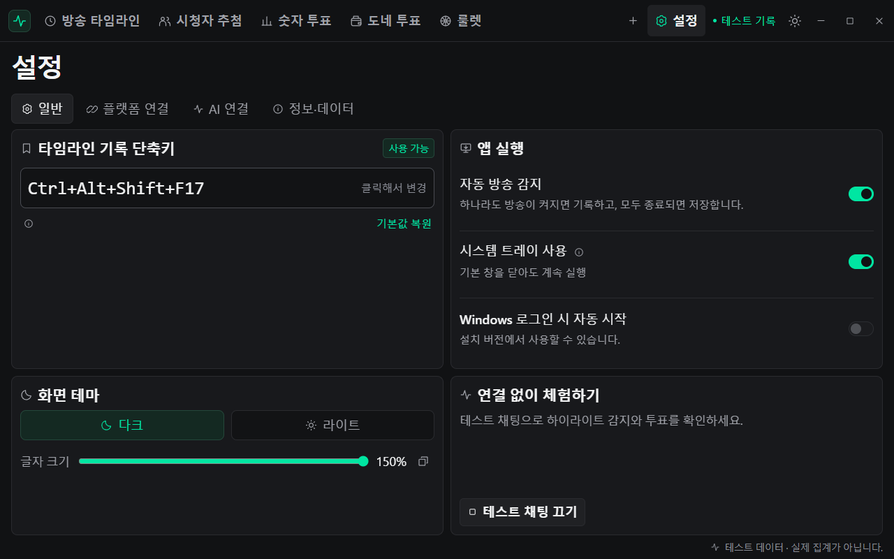

# User guide

[한국어](user-guide.ko.md) · [Product overview](../README.md)

Try the tools with generated chat first, then connect a real broadcast. The interface is Korean.

[Connections](#platform-connections) · [Chat history](#chat-history-and-date-selection) · [Tabs and windows](#tabs-and-window-layout)

## Try it offline

1. Open **방송 타임라인 → 방송 기록 시작** (Timeline → Start recording).
2. Enable **설정 → 일반 → 테스트 채팅** (Settings → General → Test chat).
3. Start a **시청자 추첨** (Viewer raffle) or **숫자 투표** (Number vote). Roulette also works independently.

The app generates sample messages without accounts or payments. Turn test chat off before using a real broadcast.

Trying the development build

Run `npm run dev`. Open **방송 타임라인** (Broadcast timeline), start recording, then enable **설정 → 일반 → 테스트 채팅** (Settings → General → Test chat).

Generated events create highlights, raffle entrants and sample donations. A test platform appears while demo mode is active. Demo events do not post platform polls or charge donations. Turn test chat off before using real platforms. Roulette works independently.

## Platform connections

Open **설정 → 플랫폼 연결**.

| Platform | How to connect |
| --- | --- |
| CHZZK | Enter a public channel URL or channel ID |
| YouTube | Approve in the browser as the broadcast channel owner |
| Twitch | Approve chat reading in the browser as the broadcaster |

Audience tools show connected platforms. Select one confirmed live with chat ready; offline or unknown-state platforms cannot start participation.

Check the [platform limits](#platforms-and-limits).

Reconnection, authorization and developer setup

Open **설정 → 플랫폼 연결** (Settings → Platform connections).

| Platform | Connection                                                                                  | Participation                                                                                                      |
| -------- | ------------------------------------------------------------------------------------------- | ------------------------------------------------------------------------------------------------------------------ |
| CHZZK    | Public channel/live URL or channel ID, without login or developer app registration.         | Read-only chat, keyword votes, raffles and supported Cheese messages. Copy instructions to announce them yourself. |
| YouTube  | Browser login as the broadcast channel owner; active broadcast chat is found automatically. | Chat commands, native live polls, raffles and supported Super Chat messages.                                       |
| Twitch | Browser Device Code login as the broadcaster; the app connects to that user's own channel. | Chat highlights, number votes and subscriber/founder raffles. Bits donation voting and Twitch native polls are not supported yet. |

Your own YouTube-enabled build needs [developer OAuth configuration](development.md#youtube-oauth). Users grant access in the browser rather than entering tokens. With no active broadcast, the app waits; **방송 채팅 다시 찾기** searches again.

Twitch-enabled builds need a [Public client configuration](development.md#twitch-oauth). The browser opens Twitch's activation page; approve chat read access using the code shown in Settings. Login can be canceled in the app. Twitch chat can connect while the channel is offline. If authorization expires or is revoked, reconnect the account. A local logout removes the saved tokens; permissions can also be revoked in Twitch's Connections settings.

Only connected platforms appear as participation buttons, and only confirmed live broadcasts can be selected. Offline or unconfirmed broadcasts are disabled and rejected by the backend. Selected platforms also need live chat ready. Starting a vote freezes platform/command settings. You cannot start with no platform selected.

## Timeline and highlights

Use the **타임라인 · 채팅·후원 · 분석·AI 데이터 · AI 분석 · 다시보기 수집** tabs at the top of the workspace. Navigation sits above the broadcast controls and stays in the same position when switching views. Scroll the tab bar horizontally in a narrow window. Select a broadcast on the right; **채팅·후원** has its own broadcast/date selector inside the archive panel.

Viewer-axis values and timestamps retain their proportions when the window grows and follow the text-size setting. Keyboard focus appears inside tab buttons and filters. See the [timeline screen](assets/screenshots/timeline.png).

1. Press **방송 기록 시작** to record. Enable **방송 자동 감지** for automatic start.
2. Press **마커** or the global shortcut at a moment to revisit. Installed builds default to `Ctrl+Shift+F8`.
3. Press **방송 기록 종료** to save. Chat, viewer samples and marked moments remain available.

Every window shares the same recording. Closing a timeline tab preserves collection; stopping recording affects all windows. Automatic highlights are editing candidates found from chat reactions.

Automatic detection, shortcuts and highlight conditions

Recording start/stop, chat/donation records, viewer samples and markers are shared by every timeline tab and window. Adding, cloning or detaching a tab does not create another platform connection or collector. Polls, raffles and other tools consume the same platform workers' data. Closing all timeline views leaves common recording running; **방송 기록 종료** stops it for every window. Each tab can independently choose search filters and a past broadcast to display.

Enable **방송 자동 감지** in the timeline or Settings → General. Any connected channel confirmed live starts recording; recording ends when every connected channel is confirmed offline. A failed request remains unknown and does not close the timeline. The earliest available platform start time becomes the common clock; if unavailable, detection time is used. Capture begins when this app collects messages, so missing earlier chat is not reconstructed.

Manual recording remains available: enter a title and elapsed seconds, then press **방송 기록 시작** (30 minutes = `1800`). Manually stopping an ongoing detected stream prevents its immediate restart until it ends or automatic detection is re-enabled.

Record a moment with the global shortcut or the **마커** button. Defaults are `Ctrl+Shift+F8` for installed builds and `Ctrl+Alt+F8` for development. In **설정 → 일반 → 타임라인 기록 단축키**, click the capture field and press a combination or F1–F24. The previous shortcut is retained if registration/save fails.

The viewer graph shows platform-reported concurrent counts, with an aggregate or per-platform view. Unknown/unavailable samples are gaps, rather than zero estimates. Markers and records adapt to the window with pagination.

Automatic highlights need at least **15 messages from 5 participants within 10 seconds**, at **2.5 times** the preceding 60-second baseline, with a 45-second cooldown. They suggest a clip start 15 seconds earlier. These are local statistical editing candidates. No video/audio recording or external AI judgment is performed.

## Chat history and date selection

Use **방송 타임라인 → 채팅·후원** to filter by broadcast, platform, text or participant. It starts with all broadcasts/dates; scroll down to load older records.

To manage stored dates:

1. Open **날짜·용량 관리** and choose day, week or month.
2. Select dates and review their size.
3. Select **선택 날짜 삭제** and confirm. Active recording dates are protected.

Search, date selection and deletion rules

Open **방송 타임라인 → 채팅·후원**. The default scope is **전체 방송·전체 날짜** (all broadcasts/dates). Filter to a broadcast, CHZZK/YouTube/Twitch or all platforms, chat/donation type, text or participant. A selected broadcast also supports elapsed-minute filters. Rows show the original local date/time. Scroll down inside the list to load older records continuously. Queries load bounded batches and only nearby rows are rendered. Changing filters starts a new list; live updates refresh the list when it is at the top. Text-size changes preserve the row being read.

Open **날짜·용량 관리** to manage storage:

1. Switch between **일별 / 주별 / 월별**: day, Monday-based week or month.
2. Click multiple groups, Shift-click a range, set start/end dates, or use **전체 선택**. Selecting a week/month selects its stored dates; zoom changes preserve those dates.
3. Read the selected size. It sums actual encrypted original-file lengths, including participant/viewer events. Shared date/statistical indexes are excluded; disk allocation-unit usage differs.
4. Press **선택 날짜 삭제** and review the dates/size confirmation. Dates belonging to an active recording are protected. Other dates and markers remain; statistics are rebuilt.

Older shared files can span multiple dates. Their physical size is counted once in the selected scope, and shared bytes are identified. Compaction and retained participant profiles can make reclaimed space differ from the preview. Interrupted deletion resumes on reopening. No history is pruned automatically by session count.

## Analysis and exports

In **분석·AI 데이터**, inspect chat activity, reactions, frequent terms and participant statistics.

| Export | Purpose |
| --- | --- |
| **기록 내보내기 / JSON** | Save broadcast title, times and markers as Markdown or JSON |
| **분석 데이터 내보내기** | Save chat, donations, viewer samples and statistics as JSONL |

Analysis exports use pseudonymous nicknames by default. Personal information typed into message text remains, and exported files are unencrypted.

Export fields and participant identity

**분석·AI 데이터** provides minute activity, lexical reactions, frequent terms and participant statistics. Participant keys distinguish platform accounts across broadcasts on this installation. Subscription/role/badge values reflect information actually provided by the platform.

| Export | Contents |
| --- | --- |
| Header **기록 내보내기 / JSON** | Selected broadcast metadata, markers and highlight evidence in Markdown/JSON. |
| **분석 데이터 내보내기** | JSONL with times, participants, chat, donations, viewer samples, markers and local statistics. |

Default JSONL removes public native account/message IDs and uses pseudonymous nicknames; analytical speaker keys remain linkable. **공개 닉네임·플랫폼 ID 포함** includes public identity fields. Chat text, marker notes and reaction examples stay original and may contain personal information. Exports are ordinary unencrypted files.

## Viewer raffles

1. In **시청자 추첨**, recruit from any chat or a participation keyword.
2. Optionally filter subscribers/members and exclude previous winners.
3. Draw during or after recruitment. The app selects one person from the complete eligible roster.

Each platform account enters once. New recruitment resets participants and winner history.

Reel animation, eligibility and participant limits

Recruit from any chat or a keyword (default `!참여`). Optional filters cover CHZZK/Twitch subscribers, YouTube members and previous winners; an optional timer ends recruitment. Twitch subscriber status comes from Subscriber or Founder chat badges.

An account enters once per platform. Draw during recruitment or after it closes. Cryptographically secure randomness selects one eligible entrant from the entire pool. A circular drum has exactly one equally spaced face for each draw-time eligible name. The drum repeatedly rotates downward, slowing over three seconds to stop on the chosen entrant. All eligible entrants occupy a face regardless of the recent list's 100-name display limit. New entrants and name changes during a draw apply to the next draw. Moving across tabs/windows resumes the same frozen roster and draw clock; reduced motion shows the result directly. The draw lock prevents duplicate requests. Results persist across tabs/restarts. A new recruitment resets entrants and winner history.

The latest 100 names are shown; all eligible entrants are included in a draw. The former 10,000-entrant cutoff is removed.

## Number votes

1. Enter a question and **2–4 choices**, using Add or Enter.
2. Select participating platforms and start. The default chat command is `!투표1`.
3. Watch the result and select **투표 종료**. Import the ended vote into roulette if desired.

YouTube also offers a native live poll instead of chat commands. **자동 종료 타이머** sets an optional closing time from 1 second to 24 hours in minutes/seconds.

Commands, vote changes, YouTube polls and timer rules

Enter a question and **2–4 choices**. **추가** or Enter adds a choice, clears the field and leaves it focused. Enter during Korean IME composition does not add one. Rows can be edited/removed; initial guidance is placeholder text.

The default accepts `!투표1` or `!투표 1`, followed optionally by ordinary chat. Change the prefix (up to 12 characters), or leave it empty to accept an exact number like `1`. Copy the participation instructions to explain the rules.

Each platform account holds one vote; a later valid command moves it to the latest choice. Identities are not merged across platforms. Older saved polls retain their original bare-number/first-vote rules.

Choose YouTube chat commands or its native live poll. Native mode excludes YouTube chat commands from that vote to avoid counting both methods.

Enable **자동 종료 타이머** and enter minutes and seconds to finish automatically after 1 second–24 hours. It is off by default. The broadcast view shows the time remaining. One backend owns the deadline across tabs/windows, including after a tab closes or the app restarts. Failed native YouTube poll closes are reported and retried.

Starting opens the broadcast view with totals, percentages, commands and elapsed time. **결과 가리기** hides results, **투표 설정** revisits setup, and **투표 종료** finishes. Ended results and the frozen timer remain; **새 투표** opens a blank form. Import ended results into roulette.

## Donation votes

Count qualifying new CHZZK Cheese or YouTube Super Chat messages.

1. Set the question, **2–4 choices**, command and currency.
2. Choose one vote per person or votes by amount.
3. Start, review results and end. An optional closing timer is available.

Different currencies are not converted. Ordinary chat, anonymous donations, stickers and historical messages are excluded. Twitch Bits donation voting is unsupported.

Amount examples, currencies and deduplication

Choose 2–4 options, a command (default `!투표`), currency and amount rule. The optional **자동 종료 타이머** takes minutes and seconds (1 second–24 hours) and keeps its deadline across tab/window moves and app restarts.

| Rule                    | Behavior                                                                                                    |
| ----------------------- | ----------------------------------------------------------------------------------------------------------- |
| **One vote per viewer** | A donation at or above the minimum gives one vote. Another qualifying donation changes the viewer's choice. |
| **Votes by amount**     | Each donation adds `floor(amount / amount-per-vote)` votes. Remainders do not carry to later donations.     |

At 1,000 KRW per vote, 2,500 KRW gives 2 votes; a later 500 KRW gives none. CHZZK Cheese uses KRW. YouTube Super Chat must match the selected currency (KRW, USD, JPY, EUR, GBP, CAD or AUD). Other currencies are skipped and reported, without conversion.

Only new supported donations with identifiable accounts and valid commands count. Ordinary chat, anonymous donations, stickers and historical messages are excluded. Duplicate donation IDs are ignored, including after restoring results.

Donation votes have the same broadcast view and roulette import. The former 50,000-event cutoff is removed; one billion votes per choice remains the arithmetic limit.

## Weighted roulette

1. Enter **2–12 entries** and weights, or import an ended vote.
2. Select **방송용 룰렛 보기 → 돌려!**.
3. Watch the wheel stop on the selected entry.

Slice sizes match actual probabilities. Zero-weight entries cannot win, and entries cannot be edited during a spin.

Weight bounds, motion and saved state

Create **2–12 unique entries** with integer weights from 0 to one billion, or import combined results from an ended vote. Zero-weight entries cannot win; the total must be positive.

Open **방송용 룰렛 보기 → 돌려!**. The Node engine securely chooses a weighted interval. Slice sizes, displayed percentages and draw probabilities match; the animation stops on the selected slice.

Each spin randomly takes 4–7 seconds; there are no duration settings. Reduced-motion preferences show the result immediately.

Editing/import is locked during a spin. Switching tabs preserves the spin/result. Title, entries and weights persist locally; Settings → Info & Data can reset them after confirmation.

## AI connections and function analysis

AI analysis is optional.

1. Add an AI in **설정 → AI 연결 → +**, then sign in or connect an API key.
2. Query models and assign one in **기능별 AI**. Selections save automatically.
3. In **방송 타임라인 → AI 분석**, review the function, record scope and transmission preview before running.

Selected records go to the assigned CLI/API, and API charges may apply. Pseudonyms do not remove personal information inside the text. The [AI guide](ai-integrations.md) explains connections, group settings and cancellation.

Function assignments, accounts and retained results

1. Add an AI with **Settings → AI 연결 → +**. Its connector downloads automatically. Prepare the CLI separately with **다운로드·설치** or **설치 관리 → 설치 찾기** to detect an existing installation.
2. Choose **CLI/API**, then sign in or save an API key. After CLI authentication, **모델 조회하고 계속** retrieves models; the API dialog uses **저장하고 연결 확인**. Save the connection's basic model with **연결 저장**.
3. In **기능별 AI**, assign an overall or group default. Chat analysis includes free-form analysis, question organization and reaction analysis; broadcast review includes summary and highlights; donation analysis includes donation summary. Changes to AI/model/reasoning dropdowns save automatically. Disable **그룹 따르기** to use an individual setting. Settings apply in the order **individual function → group → overall default**. Choose **AI 사용 안 함** to disable analysis for that scope.
4. In **방송 타임라인 → AI 분석**, choose the function, broadcast, platform, dates and elapsed-time range. Review the resolved AI, model, reasoning level, included/total records and sampling before running. If the function has no usable AI, **AI 지정하기** opens its settings.
5. Review result usage, available CLI limits and estimated API fees. Running requests can be stopped; saved results can be reopened or deleted.

Codex, Claude, Grok and Kimi use app-specific login profiles. Antigravity uses the shared PC session only after **PC 로그인 공유** is explicitly enabled. Signed-in CLIs show **로그인 완료**; sign out before switching accounts. Change API keys through **API 키 관리**. CLI subscriptions and API billing are separate.

Analysis defaults to pseudonymous nicknames without public account IDs, while personal information typed into chat remains in the text. The selected records are sent to the assigned CLI/API when you run analysis. This optional analysis is separate from automatic local highlights. See [AI connections](ai-integrations.md) for authentication, settings and transmission behavior, and [data formats](timeline-data.md) for archive details.

## Tabs and window layout

Drag tabs to reorder them or drop them on another window's tab strip. Add tools with **+**.

Right-click a tab for:

| Menu | Action |
| --- | --- |
| **새 창에서 보기** | Duplicate the current draft/view in another window |
| **새 탭에서 보기** | Duplicate the current draft/view in a new tab |
| **닫기** | Release that view and its temporary inputs |
| **모두 닫기** | Close tool tabs in the current window |
| **비활성 탭 숨김** | Hide inactive tool placeholders |
| **탑바 숨김** | Show the topbar when hovering over the top of the window |

Recording, collection and running votes/raffles are shared and survive tab closure. Searches, drafts and roulette state remain per tab. Tab layouts and window positions survive restart.

Dragging, inactive slots, restoration and screenshots

Drag a timeline, raffle, number poll, donation poll or roulette tab left/right to reorder it. Pulling one of several loaded tool tabs in that window outside the strip opens a separate window. Dragging that window's last loaded tool tab moves its existing window without creating another one. Inactive slots, Home and Settings do not count as loaded tool tabs. When two or more app windows exist, only the window moving during a tab drag becomes translucent; other windows stay opaque. With one app window, movement stays opaque. Drop a tab onto any other window's strip to transfer it. Original opacity returns after releasing or canceling a drag. Every window has Home, tool creation and a fixed **설정** (Settings) tab. Escape restores the original layout and position. Click the logo to open Home, or drag it to move the whole window.

The tab context menu contains **새 창에서 보기 / 새 탭에서 보기 / 닫기 / 모두 닫기 / 비활성 탭 숨김 / 탑바 숨김**: View in new window, View in new tab, Close, Close all, Hide inactive tabs and Auto-hide topbar. Close all unloads every tool in the current window and restores inactive baseline slots while preserving other windows and fixed Settings. New-window/new-tab commands copy the current draft and view while keeping the original tab. Multiple tabs of the same kind can coexist, with their own inputs and roulette configuration/spin state. The **+** button can add any tool to any window.

When a window has multiple open tabs of the same kind, their labels receive **1, 2…**. Closing or moving tabs so only one remains removes its number automatically.

Every window has a baseline slot for every tool kind. Tools not yet opened, or whose loaded tabs were closed, appear as translucent inactive **+** slots. Transferring a tool also preserves its baseline slot when the source window still has another loaded tool. These slots allocate no tool screen, inputs or timers. Click one or use **+ → 비활성 탭 열기** (Open inactive tab) to load it.

Loaded tabs keep their screen and data when another tab is selected. **닫기 / 모두 닫기** (Close / Close all) releases the affected screens, timers and transient drafts. Other loaded tabs of the same kind remain when closing one tab; closing the last one restores its inactive baseline slot. Docking a window's last loaded tool into another window transfers its data and closes the source window. This also applies to the primary window: the destination becomes the primary window. The consumed source is not recreated on restart.

Hide inactive tabs hides only the translucent baseline indicators and preserves their slot information. This option is saved per window, copied when creating a new window and independently editable afterward.

**탑바 숨김** expands content into the topbar's space. Hover over the top of the window to slide the topbar into view; moving away hides it. It stays open while using menus or dragging tabs, including when dragging onto another window's hidden topbar. Clear the option from a revealed tab's context menu to keep it visible. The setting is saved per window, copied to new windows and restored after restart.

Each window's tabs, order, closed state, active tab, hide option and position/size save automatically and restore after restarting. Closing an entire secondary window returns its tabs to the main window. Broadcast recording, chat collection, platform accounts and ongoing polls/recruitment are shared across windows and continue after closing a tab. Saved records and each tab's saved roulette configuration are retained.

## Window, tray and data

Adjust text from 95% to 150% in **설정 → 일반 → 화면 테마 → 글자 크기**. Releasing the slider applies the value across windows; it survives restart.

- Closing a secondary window returns its tabs to the primary window.
- With the tray enabled, closing the primary window preserves collection. Exit fully through the tray menu.
- With the tray disabled and only the primary window remaining, Close saves and exits.

Delete records with confirmation in **설정 → 정보·데이터**. End recording, recruitment and votes first. Exported files and external backups remain user-managed.

Text size, closing, storage files and deletion scope

Drag the frameless header to move the window. Custom controls minimize/maximize/close it. Themes persist and Windows reduced-motion preferences are respected. Use the slider from 95% to 150% in 5% steps under **설정 → 일반 → 화면 테마 → 글자 크기**. The default is 100%, with a reset button. Dragging previews the percentage; releasing applies it. Arrow keys, Home and End also adjust the value. Text size synchronizes across windows and survives restart. The outer layout stays within the window at the 900 × 650 minimum; long lists scroll inside panels. Larger text adjusts spacing while broadcast status and action buttons remain within the window. AI connections show six providers per page with previous/next controls. Long login instructions scroll within the dialog while its footer actions remain visible.

- **Secondary window:** closing returns its tabs to the primary window.
- **Tray on:** closing the primary window hides it; collection and timers continue in Electron main. Exit fully through the tray.
- **Tray off:** closing the only remaining primary window saves records and exits. With secondary windows still open, closing the primary window hides it.
- **Startup:** installed EXE builds offer a toggle; MSIX opens Windows Startup Apps settings. Development does not change Windows startup.

Records are encrypted in `records.enc` and YouTube/Twitch tokens in `accounts.enc` using Windows DPAPI, under `userData` (typically `%APPDATA%/streamer-assist`). Preferences and roulette entries are local configuration; Markdown/JSON/JSONL exports are ordinary files.

Recording metadata, markers and participation results are saved in `records.enc`; original chat/donation/profile/viewer events live under `timeline-data/<broadcast UUID>/`. The latest-100-session retention limit is removed. Live reaction detection maintains exact 10/70-second counts incrementally. Raw batches use AES-256-GCM with a DPAPI-protected profile key; participant profiles are encrypted in disk-backed indexes. Read caches are bounded while original events remain available. Legacy plaintext metadata migrates after encrypted saving succeeds.

**설정 → 정보·데이터** provides the bundled privacy policy, demo instructions and confirmed deletion. End recording/recruitment/votes before deleting. Deletion removes records and encrypted recovery copies, preserving account connections and settings. Disconnect YouTube separately; revoke permissions through Google's connected-app settings if needed.

## Platforms and limits

- **CHZZK:** unofficial public read-only chat; login-restricted streams are unsupported.
- **YouTube:** requires the broadcast channel owner's authorization and an active broadcast.
- **Twitch:** chat highlights, number votes and subscriber/founder raffles; native polls and Bits donation voting are unsupported.

Automated checks use simulated responses. Real authentication, stream reception and paid events need additional live-platform validation.

Collection/authentication protocols and verification scope

- CHZZK uses an unofficial, read-only public-chat protocol. Login-restricted streams are unsupported and upstream changes can interrupt connection. Channel changes/disconnections are checked periodically; temporary anonymous read credentials stay in memory.
- YouTube uses official APIs and respects `pollingIntervalMillis`. OAuth requests `youtube.force-ssl` with PKCE and a temporary loopback callback on `127.0.0.1`, which closes after login.
- Twitch uses official EventSub WebSockets with `user:read:chat`. Reconnects retain deduplication; messages originating in other channels during Shared Chat are excluded. Bits messages are archived as donation events with the BITS unit; Bits donation voting and Twitch native polls are not enabled.
- Hidden CHZZK messages are not collected. Available historical chat is archived with original times and a historical flag; it is excluded from live burst detection and voting. Anonymous CHZZK donations and YouTube paid stickers can be archived without becoming donation votes.
- Automated checks use mock responses, a local Twitch EventSub socket and isolated profiles. Real YouTube/Twitch login, live chat/native polls and paid donation reception require validation in a broadcast environment before production release.
- CI installation checks are not Microsoft certification; see [Store setup](store-setup.en.md).

## Post-broadcast chat collection

In **Settings → Broadcast recording**, choose live archive, live raw archive with later analysis, or live participation with later replay collection. The choice applies to the next session. After ending, use **Timeline → Replay collection** to discover matched broadcasts or add VOD URLs one at a time. Import available chat, pause/retry and optionally compute statistics/highlights. Adjust video start time when necessary. Helper downloads are optional/app-local; videos are not downloaded. Missing/deleted/restricted replay chat cannot be reconstructed. See [data format and limits](timeline-data.md).

## References

Participation rules were informed by [CHZZK VOTE](https://github.com/WisdomIT/chzzk-vote), including its [vote parser](https://github.com/WisdomIT/chzzk-vote/blob/master/lib/vote.ts) and [result logic](https://github.com/WisdomIT/chzzk-vote/blob/master/app/%28main%29/vote/_views/Running.tsx). The public chat protocol was informed by [kimcore/chzzk](https://github.com/kimcore/chzzk). Streamer Assist does not connect through the reference voting site.
